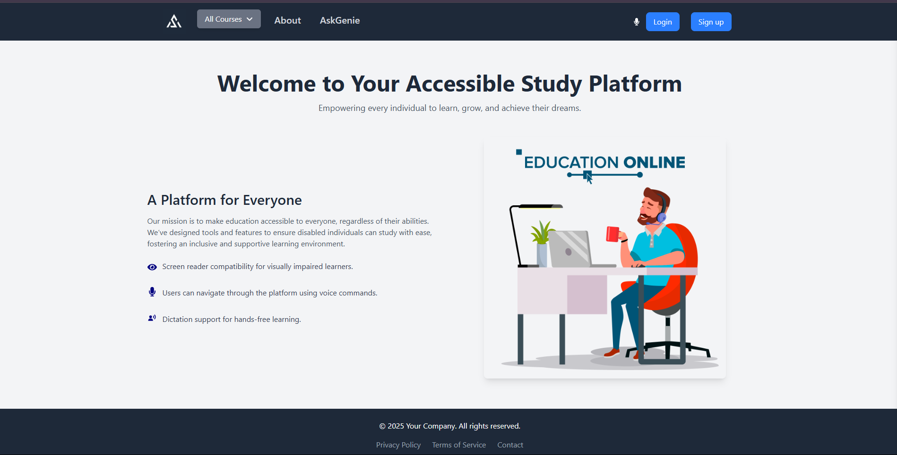
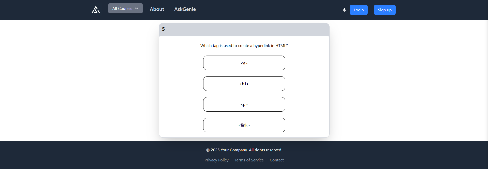
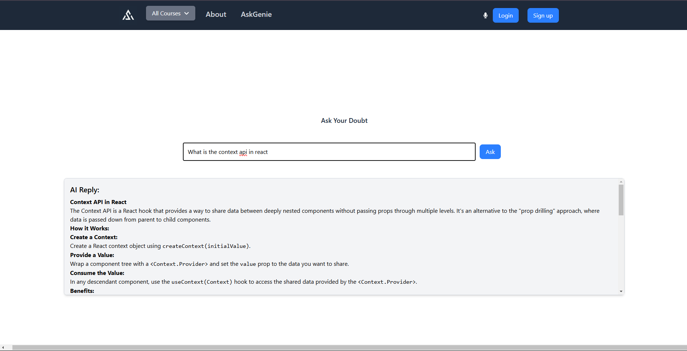
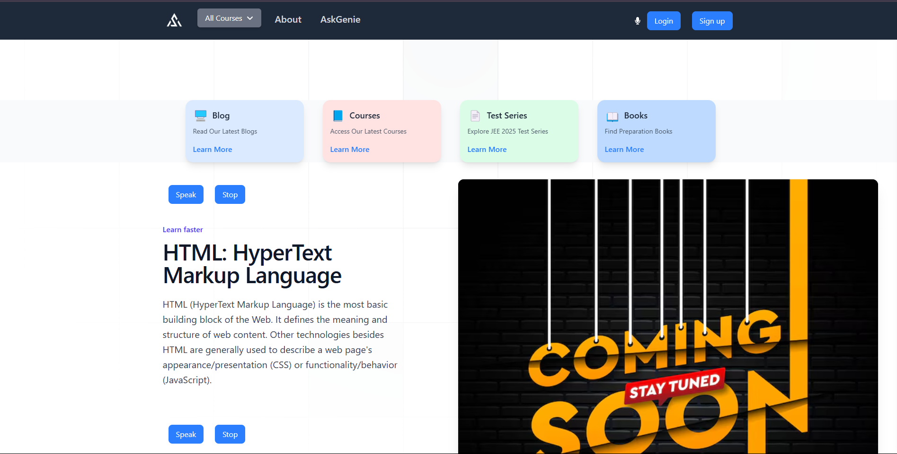

# Accessible Platform for Blind Users

Welcome to the **Accessible Platform for Blind Users**, an inclusive solution aimed at empowering visually impaired individuals by leveraging cutting-edge technology. This platform enables blind users to navigate, learn, and engage independently.

---

## 🌟 Features

### 1. Seamless Registration
- Voice-guided interaction for an easy and independent registration process.

### 2. Document Listening
- Converts web page content into an audio format for blind users to access written documents effortlessly.

### 3. Interactive Quizzes
- Blind users can participate in quizzes by listening to the questions and responding interactively.

### 4. AI-Powered Doubt Solver
- An intelligent AI system to assist students with resolving their academic doubts effectively.

---

## 🛠️ Technologies Used

- **React.js**: Frontend framework for creating a responsive and interactive user interface.
- **Node.js**: Backend to support the application logic.
- **Text-to-Speech (TTS)**: Converts text into spoken words for accessibility.
- **AI/ML**: Enhances doubt-solving capabilities with intelligent responses.

---

## 🚀 How to Run Locally

Follow these steps to set up the project on your local machine:

1. **Clone the Repository**
   ```bash
   git clone https://github.com/Arindamsharma12/algoshastra.git
   cd algoshastra
   ```

2. **Install Dependencies**
   ```bash
   npm install
   ```

3. **Start the Development Server**
   ```bash
   npm run dev
   ```

4. **Access the Application**
   Open your browser and navigate to `http://localhost:5173`.

---

## 📚 How It Works

1. **Registration**: Users are guided through a simple registration process via voice instructions.
2. **Document Listening**: The platform reads documents available on webpages aloud.
3. **Interactive Quizzes**: Quizzes are accessible through audio questions and user responses.
4. **AI Doubt Solver**: Provides voice-guided solutions to academic queries.

---

## 📷 Preview





---

## 🤝 Contribution Guidelines

We welcome contributions from the community! To contribute:

1. Fork the repository.
2. Create a new branch for your feature or bug fix.
3. Commit your changes and push them to your fork.
4. Submit a pull request, describing your changes in detail.

---

## 📞 Contact

Feel free to reach out for any queries or suggestions:

- **Email**: techyarindam@gmail.com
- **GitHub**: [@Arindamsharma12](https://github.com/Arindamsharma12)

---

## 🎉 Acknowledgments

This project is dedicated to making technology accessible and inclusive for everyone. Special thanks to the open-source community for continuous inspiration and support.

---

### 🌟 Let's build an inclusive future together!
